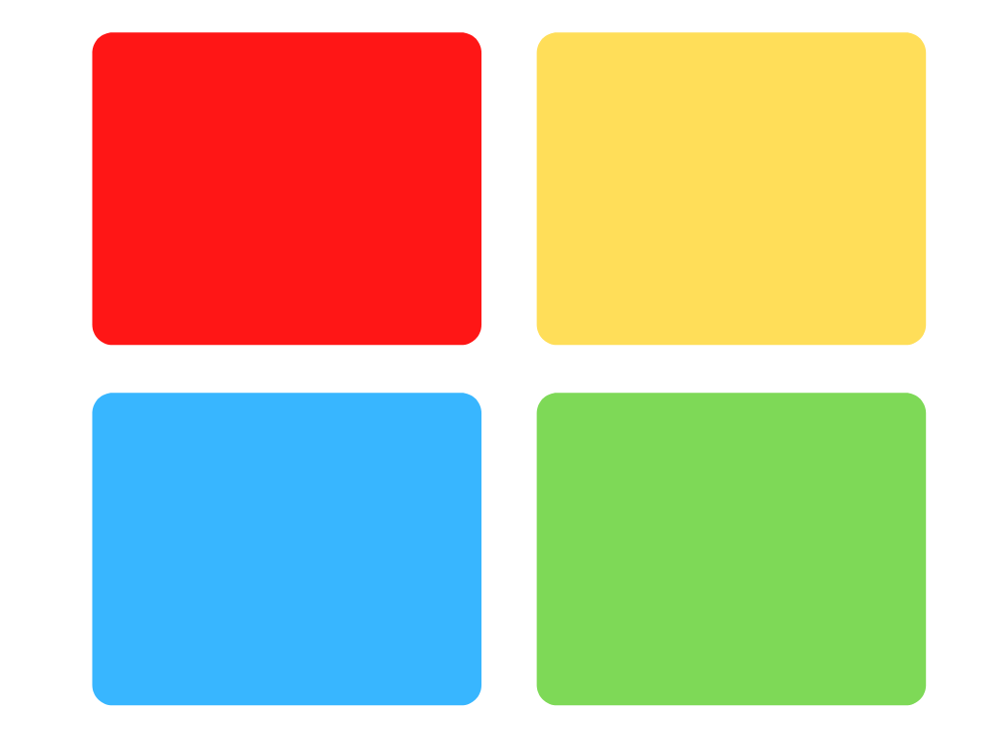

Les couleurs sont et seront toujours utilisées dans le Marketing. En effet, les couleurs font naître en chacun d'entre nous une émotion, un sentiment. Mais savez-vous que votre couleur préférée représente votre personnalité ?

Le psychiatre autrichien [Carl Jung](https://fr.wikipedia.org/wiki/Carl_Gustav_Jung) dans ses travaux sur la [typologie jungienne](https://fr.wikipedia.org/wiki/Typologie_jungienne) a analysé différents modes de fonctionnement en fonction des personnalités de chacun. Plus tard, Isabelle et Katherine ont développé la méthode "[4 Colors](https://www.funny-learning.com/fr/la-methode-4-colors.html?fbclid=IwAR1jWcGjz6viL4llkWLct5yDZoyIRwJn22uZAdsE8DlhA9-F7EJY1mnL2S8)", associant les personnalités de Jung à une couleur. Mais maintenant, regardez les 4 couleurs ci-dessous, et la question est : Quelle est la couleur qui vous attire le plus ?

## Rouge :

Vous avez choisi le rouge comme 18% des participants ( dont 75% de managers et directeurs de service !).

Le rouge, dans le travail de Jung représente la dominance, l'extraversion. Les rouges sont exigeants, compétitifs et volontaires. Ils aiment les résultats et les décisions rapides. Enfin, les "rouges" expriment leurs sentiments de façon directe et sans filtre ce qui permet une communication simple.

Cependant, ils sont très régulièrement impatients et rigides dans les décisions prises par les autres. Il faut donc prendre du recul et être diplomate lorsque vous êtes confronté à un "rouge" !

## Jaune :

Vous avez choisi le jaune comme 28% des participants !

Dans le travail de Jung, le jaune représente l'influence. Ce sont des personnes extrêmement optimistes et enthousiastes pour tous les projets. Les "jaunes" sont des personnes créatives, qui aiment les projets innovants ! Mais leur principal trait de caractère est la sociabilité, l'esprit d'équipe est c'est pour cela qu'ils sont souvent très influents dans les groupes de travail.

Malheureusement, ils sont également beaucoup trop BAVARDS ! En effet, les projets sont LEURS projets et ils ont tendance à vouloir faire beaucoup de réunions afin d'assurer un bon déroulement du projet (cela doit vous rappeler un type de manager, sinon découvrez l'article sur les [types de management](https://keskec.fr/management/elouan/1097/)).

## Bleu :

Vous avez choisi Bleu comme 14% des participants !

Le bleu dans le travail de Jung, représente un esprit Analytique. Les "bleus" sont des personnes prudentes et minutieuses dans leur travail quotidien. Ils ont un esprit logique et précis qui leur permet de réfléchir sur des problématiques complexes. Enfin ils sont ordonnés et disciplinés dans leurs démarches, ce qui est très apprécié en entreprise.

A contrario, ils sont très indécis, ce qui peut contribuer à créer chez eux du pessimisme. Ils ont tendance à se perdre dans les détails et mettent du temps à terminer leur tâches. Enfin, si vous devez critiquer leur travail ou leur comportement, faites attention, ils peuvent le prendre très mal !

## Vert :

Vous avez choisi Vert comme 40% de la population, félicitations vous êtes dans la majorité !

Les verts sont des personnes solidaires avant tout, qui veulent faciliter les relations humaines dans l'entreprise ! Ils sont à l'écoute de leurs collègues et font toujours preuve de patience, ce qui est un vrai plus dans le travail d'équipe.

Malheureusement, les délais ne sont pas leur fort, alors il faut faire preuve de patience en retour. Mais leur plus gros défaut est également leur plus grande qualité : leur solidarité ! Ils n'aiment pas que le ton monte et vont donc tout faire pour éviter de monter au créneau !
