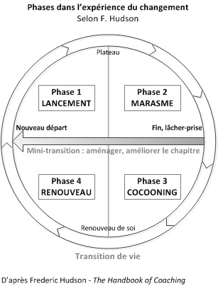

La roue de Hudson est un outil permettant à toute personne qui prévoit un changement dans sa vie professionnelle de se repérer dans le processus de son projet. Plus qu'un guide, cet outil est également utile dans le cas où tout ne se passe pas comme prévu et où des modifications doivent être apportées au projet initial.

Attention à ne pas confondre ce schéma avec [La roue du changement de Kanter](https://cristalea.fr/management/la-roue-du-changement-en-management-de-projet/), qui est un outil utilisé dans la gestion du changement au sein des organisations.

Cet outil se décline en 10 étapes, en fonction de votre avancée dans le changement. Cependant, il n'est pas nécessaire d'effectuer ces 10 étapes pour qu'un projet soit réussi. Il faut avant tout que les 3 premières étapes se déroulent sans encombre.

La roue de Hudson - Source : https://kolibricoaching.com/motivation-neurosciences/le-cycle-du-changement-interieur/

### Définir le projet

Cette étape est commune à chaque projet. Elle permet de définir le projet, d'analyser les différentes problématiques qui lui sont associées et de créer un plan d'action afin de mettre en oeuvre ce projet. Cela peut être un changement de poste, d'entreprise ou même de métier.

### Mettre en place le projet

C'est à cette étape que l'on met en action la stratégie qui a été adoptée lors de la première étape pour conduire ce changement. Plan d'action, formation, tout doit être mis en oeuvre afin de conduire à la réussite de votre projet.

### Réussir le projet

Si tout a fonctionné comme prévu, cette étape clôt le succès de l'opération. Cependant, ce n'est pas toujours le cas et encore moins du premier coup. Alors le cycle du changement continue, et il est temps de passer à l'étape suivante.

### La rupture

Il faut ici prendre conscience de la rupture qui a lieu entre l'idée de base du projet et la réalité du terrain. Différents facteurs peuvent être la cause de cette rupture, ils seront analysés à l'étape du bilan (deux étapes plus bas).

### Le deuil

Il est temps de faire le deuil du projet tel qu'il a été imaginé. Cette étape est primordiale afin de pouvoir passer à autre chose, et peut-être même voir votre objectif sous un nouvel angle. Savoir faire preuve de résilience est essentiel afin de pouvoir mener à bien un projet.

### Le bilan

Lors de cette 6ème étape, vous êtes amené à faire le bilan de ce qu'il s'est passé. Qu'est-ce qui a été et qu'est ce qui a posé problème ? Y a-t-il de nouveaux facteurs à prendre en compte ? Suis-je vraiment prêt à effectuer ce changement?

### La restructuration

Si un projet du même type est toujours à l'ordre du jour, il est donc temps de repenser ce projet, en prenant en compte les différents éléments relevés au moment du bilan. Cela permettra de mieux appréhender ce projet 2.0.

### La maturation

Cette étape est nécessaire si l'on se sent un peu perdu et que le projet, qui paraissait attractif jusqu'ici, semble petit à petit remis en question. Il convient alors de prendre le temps de réfléchir à vos objectifs et aux moyens dont vous disposez pour y parvenir.

### Le renouveau de soi

Ici, il est possible que vous vous soyez fixé de nouveaux buts, parfois même très loin de vos objectifs initiaux. Il est en effet important de reconsidérer vos valeurs, afin de pouvoir trouver un projet qui sera, peut-être, plus en adéquation avec celles-ci.

### Inventer le futur

Vous avez fait du chemin et pouvez maintenant apercevoir un futur beaucoup plus clair. Vous avez réussi à faire le point sur ce qui vous motive et ce qui vous attire, et êtes prêt à relever de nouveaux défis. Il est temps de recommencer le cycle à l'étape 1, avec un nouveau projet !

Cet article a été rédigé par [Johann Pillet](https://www.linkedin.com/search/results/all/?keywords=johann%20pillet&origin=RICH_QUERY_SUGGESTION&position=2&searchId=072783a2-4a8e-4119-b076-66889ba5f202&sid=TsT) 

## Pour aller plus loin :

- [La roue de Hudson](https://www.prospactive.com/la-roue-de-hudson/)
- [La roue de Hudson : un outil efficace pour accompagner le changement](https://www.lja.fr/fiches-pratiques/management-et-rh/la-roue-de-hudson-un-outil-efficace-pour-accompagner-le-changement-527815.php)
- [La roue de Hudson et la Programmation Neurolinguistique](https://www.intuitive-process.com/roue-de-hudson-pnl/#:~:text=Qu'est%2Dce%20que%20la,se%20pr%C3%A9parer%20%C3%A0%20la%20transition.)
