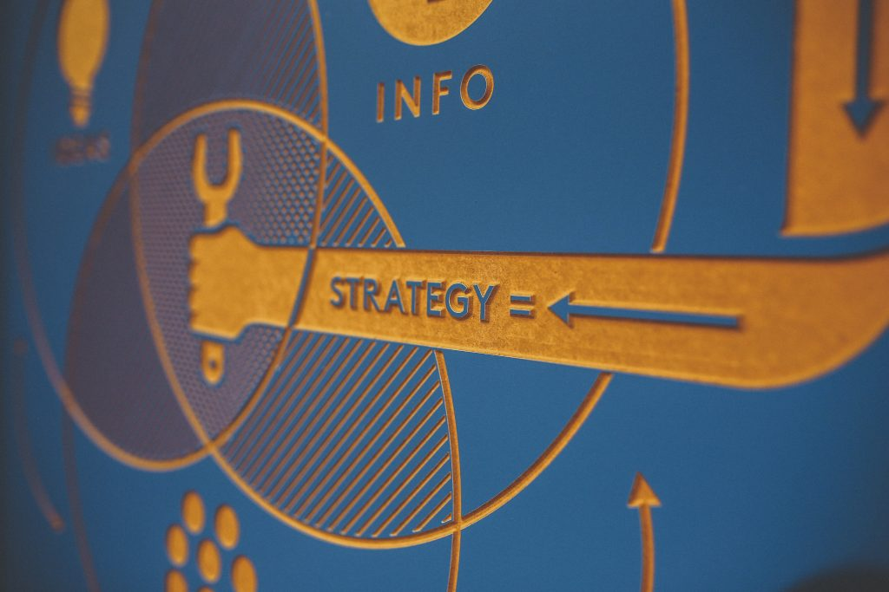

Bien connaître le marché, mais aussi les consommateurs, vous permet d'établir la meilleure stratégie possible afin de promouvoir vos offres, produits et services. Le marketing mix est une stratégie à mettre en place dans ce cas. Mais qu'est-ce que le marketing mix ?

## Les quatre « piliers » du marketing mix

Afin de prendre les décisions les plus efficaces possibles, il est indispensable de ne jamais perdre de vue quatre variables essentielles, que l'on nomme les 4 Piliers du Marketing Mix:

- Price : combien le vendre ?
- Product : quel produit / service vendre ?
- Promotion : comment le mettre en avant ?
- Place : où le mettre en vente ?

Découvrons les dès maintenant !

## P comme "Price"

Vous vous demandez pourquoi les magasins proposent des produits à 9,99 € plutôt qu’à 10 € ? Ce n’est pas pour rien. Même s’il n’y a qu’un centime de différence, vous avez l’impression que le premier prix est nettement inférieur au second, et c'est l'objectif de la dimension Price !

Un bon nombre de déterminants entrent en jeu dans la détermination du prix d’un produit ou d’un service par un Marketeur :

- Les coûts de matériaux et de production du produit ou service
- Les prix affichés par les concurrents du secteur
- L’offre et la demande des clients
- Les fluctuations du marché

Par ailleurs, augmenter la valeur d'un bien ou d'un service permet d'augmenter la valeur perçue par le client. A l'inverse, proposer un article à un prix inférieur à sa valeur réelle permet de fidéliser notre clientèle !

## P comme "Product"

Le produit est l’élément le plus important du marketing mix. Sans ce dernier, impossible de vous faire une place sur le marché. En effet, vous ne pouvez ni vendre ni promouvoir quelque chose qui n’existe pas ou pire, qui n’intéresse personne.

Même si ce n'est qu'un service (comme une banque ou un service de conseil, par exemple), il doit se démarquer sur le marché. Soit parce qu’il est unique en son genre, soit parce qu’il est meilleur que ce que proposent tous les concurrents (ou se positionne comme tel). Il faut donc montrer ses avantages, grâce à un packaging novateur par exemple !

## P comme "Promotion"

Elle recouvre la notoriété de votre marque, la gestion des influenceurs qui sont en partenariat avec vous, le marketing sur les réseaux sociaux, le sponsoring… soit toutes les interactions réalisées entre votre marque et vos clients. La promotion donne une plus grande place à la créativité que les trois autres P.

Les exemples sont nombreux et très parlants : spot radio, concours, street marketing, caravane du Tour de France, marketing sensoriel.. Il n'y a pas de limite à l'imagination.

Laissez votre imagination faire le travail de créativité !

## P comme "Place"

Tout bon commercial le sait: l'emplacement est roi (surtout dans un magasin). Dans le domaine du marketing, c’est en effet le lieu et le type d’exposition du client à votre produit qui sont la base de tout bon marketing mix.

On peut citer l'exemple des Têtes de Gondoles comme un exemple de Place efficace !  

La "place" est un concept large qui recouvre de nombreuses matérialisations, dans différents contextes. En outre, depuis l’emplacement d’un produit dans une vitrine jusqu’à une fenêtre pop-up sur Internet ou encore le placement de produit dans un film, il existe de nombreux moyens de promouvoir ce que l'on souhaite.
